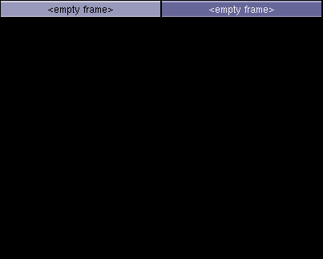
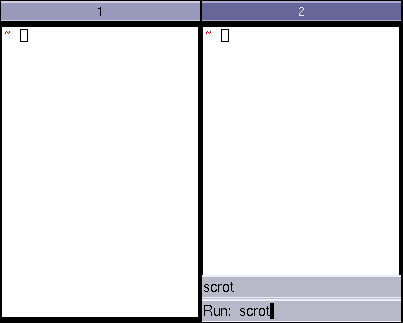
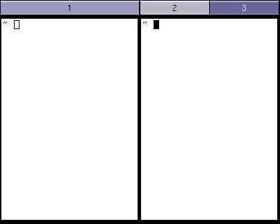
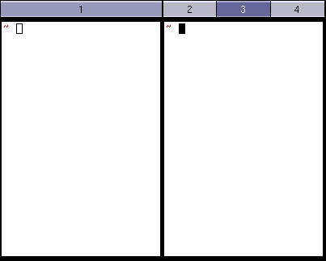
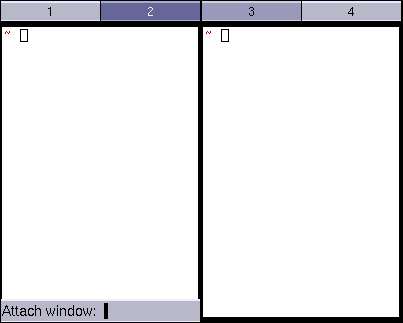
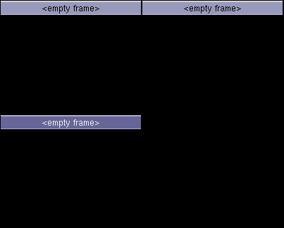

## Introduction

Notion is an interesting, 'different' Window Manager for Linux (and other systems that run X, such as Solaris). It implements some good ideas on human interface design not found in most other window managers.

Even though Notion is traditionally written to be very usable by mainly using the keyboard and rarely touching the mouse, I will initially describe how to use Notion using a mixture of those. Advanced users will probably prefer using the keyboard for more tasks.

## Getting started

I'm assuming you have been able to install Notion. When you launch Notion for the first time you will be greeted with a screen resembling the following picture.

At this early point we encounter the main difference between Notion and other tiling window managers, and also the reason we call Notion "static": Although we have not yet started any program, the screen is already split up horizontally into two 'frames'.

This is the key concept of Notion: Instead of programs dynamically altering the layout of the screen as they come and go, you choose a 'wireframe' layout for your screen and windows will be automatically moved and resized to fit into this layout. The layout can be easily manipulated, but will never be automatically altered by any program.

## Preliminaries

Below we use the following terminology. It is the standard Notion terminology also used in every other available documentation, so we'd better get used to it right away. :)

* META refers to the configured meta key. By default it is set to mod4, which should be bound to the 'Windows' key on most systems.
* The windows that appear on your screen and are managed by the window manager will be referred to as client windows or simply clients.
* A workspace is what you might know as a (virtual) desktop.

## Basic key bindings and concepts

### Getting help

Whenever you are in doubt about the bindings, just have a look at the man page.

* Pressing META+F1 brings up the man page.

It contains a commented list of all available key bindings so that you should never get lost.

### Moving around

Now that our screen is already split up in some way let us see what we can do from here. Looking at the title bars of the two frames you notice that one of them has a darker color, indicating that it is the currently selected frame. You can move the focus:

* META+N moves the focus downwards.
* META+P moves the focus upwards.
* META+Tab moves the focus to the right.
* META+K Tab moves the focus to the left.
* Moving your mouse into a frame will focus that frame

So for example pressing META+Tab moves the focus to the frame on the right.

Pressing META+Tab again returns the focus to the frame on the left.

You are almost certainly bored by now so let's bring some clients into the game.

### Launching programs

A common task is to open a new terminal.

* F2 launches a new terminal.

Whenever you launch a program it will (by default) be displayed in the frame you had currently focused and its geometry will fit the geometry of this frame. To illustrate this move focus to the right frame again.

Pressing F2 again will launch another terminal and this time it appears in the right frame.

Another way of launching a program is the following.

* F3 brings up the application launcher.

Simply type the name of the program you want to launch and press Return, just as in the terminal.

The application launcher has support for basic completion and the usual readline bindings (CTRL+A to go to the beginning of the line and so on).

You will now wonder what happens if we start a second program in a frame that is already occupied. So let's find out.

### Tabs

If you have ever used another tiling window manager you probably expect some sort of dynamic splitting to happen whenever two clients would otherwise occupy the same space. This is not what happens in Notion however. As mentioned above one of the basic rules of Notion is that a client will never alter the layout of the screen. Instead Notion will use tabs, just like your favorite web browser. Look at the situation from above.

Press F2 to launch another terminal.

You observe that the new terminal occupies the whole frame it was launched in. The title bar of the frame now consists of two tabs. Launch another terminal by pressing F2.

Now the frame accommodates three tabs, each of which represents one terminal. You can switch between the tabs by either clicking on them or by one of the following key bindings.

* META+K N selects the next frame.
* META+K P selects the previous frame.

So by pressing META+K P we bring back the third terminal we had launched.

There is one other way to select a tab.

* META+K puts a little number next to the title of each tab. Pressing this number immediately selects the corresponding tab.

Pressing 1 will select the first tab.

### Moving a client between frames

A client is bound to the frame it was originally launched in. Occasionally you will want to move a client to another frame. There are 3 methods to achieve this:

* Use the mouse and drag the window by its title bar
* Tag the client you wish to move and attach it to the frame you want to move it to
* Use the 'Attach' query to move a client to the current frame by name

The latter 2 methods are described in more detail in the following sections:

#### Tagging

* META+T tags a client.
* META+K A attaches the tagged client to the currently selected frame.

So in the situation above press META+T.

You'll notice a little anchor on the upper right corner of our second terminal. It indicates that this client is currently tagged. Now move the focus to the first frame and press META+K A.

As you see the second terminal has been attached to the first frame.

#### Using the 'Attach' query

The second method to attach is the following.

* META+A brings up the "attach client" query.

Simply type the content of the title bar of the client you want to attach and hit Return. So typing the number "3" and hitting Return will attach our third terminal.

Like all queries, this one also supports tab completion.

## Workspaces

Of course Notion has support for multiple (virtual) desktops, referred to as workspaces in the Notion terminology.

* Pressing META+F9 creates a new workspace.

So after pressing META+F9 you will again be greeted with the view familiar from the beginning of this tour.

You have just created a new workspace. Each workspace has its own layout, defaulting to a simple horizontal split. Switching between the different workspaces is achieved via the following bindings.

* META+1 (resp. META+2, resp. ...) switches to the first (resp. the second, resp. ...) workspace.
* META+period switches to the next workspace.
* META+comma returns to the previous workspace.

So pressing either META+1 or META+comma brings us back the workspace from the previous sections. Note that the bindings discussed in the previous section also allow you to move a client between frames on different workspaces.

### Creating your own layout

Let's return to the layout we've started with.

#### Creating new splits

There are three basic commands to alter the layout and create your own.

* META+S splits the current frame vertically.
* META+K S splits the current frame horizontally.
* META+K X undoes a split.

So pressing META+S once will introduce a new vertical split in the left frame.

Using these bindings you can introduce arbitrarily complicated layouts.

This particular layout will be of limited use, but you get the idea. :)

#### Resizing frames
In addition to introducing new splits you can also resize existing frames. This can be achieved by dragging the borders of a frame to the desired position or using the following key bindings.

* META+R starts the resize mode. In this mode you can
** use the arrow keys to grow a frame in a specified direction,
** use Shift+the arrow keys to shrink a frame in the specified direction,
** abort resizing by hitting Escape,
** confirm and end resizing by hitting Return.

It would be silly if you had to recreate the layouts of your workspaces everytime you restart Notion. So let's look at how to save them.

## The main menu and saving the current layout

F12 brings up the main menu.

Hit Tab to see a list of all commands that can be accessed from the main menu. In order to save the current layout, type "session/save" (or a suitable substring and make use of the tab completion) and hit Return. The layout will be stored in a file $HOME/.notion/default-session--0/saved_layout.lua and Notion will restore all the workspaces you've created together with their individual layouts whenever you launch it. This will be particularly important after we have learnt how to define client rules below.

In fact the layout is also automatically saved whenever you restart (or exit) Notion using the "session/restart" (or the "session/exit") command from the main menu.
## Toggling fullscreen mode

Sometimes you will need to maximize a window instead of having it confined to the size of a frame.

* META+Return toggles fullscreen mode on a client.

Switching a client into fullscreen mode creates a new "workspace" and moves the client to this "workspace". We put the words "workspace" into quotes here, because this new "workspace" is special in the sense that it can only manage this one particular client that it was created for. But it is nevertheless subject to the bindings for switching workspaces we have discussed above. Toggling fullscreen mode on a client that is already in fullscreen mode will return the client to its original frame and destroy the "workspace" that was created.

## Toggling vertical/horizontal maximization

Instead of putting a client into fullscreen mode, you can also maximize the frame it is in horizontally or vertically by using the following bindings.

* META+K H toggles horizontal maximization on a frame.
* META+K V toggles vertical maximization on a frame.

## 'Sticky' windows, scratchpad and dock

Notion has no support for 'sticky' windows (windows that seem present on each workspace you switch to).

There's 2 concepts that handle most of the use cases for sticky windows though: the 'scratchpad' (...) and mod_dock (...). TODO describe those in more detail :).

## Configuration

There is almost nothing in Notion that you cannot configure. The default configuration files can be found in the subfolder etc/notion of the installation directory (for example /usr/local/etc/notion). Before modifying a configuration file you should create a local copy of it in the folder $HOME/.notion and only modify this local copy.

## Changing key bindings

All of the key bindings discussed above can in fact be modified. First the META and the ALTMETA key are defined in cfg_notion.lua. The bindings for moving the focus between frames are defined in cfg_tiling.lua. And most other bindings are defined in cfg_notioncore.lua.

Let's look at an example. Say you don't like the binding for toggling the full-screen mode and want to change it to META+F. Copy the file cfg_notioncore.lua to the folder $HOME/.notion and open it in your favourite text editor. A binding is defined by a line like

    kpress_wait(META.."Return", "WGroup.set_fullscreen(_, 'toggle')"),

This particular line means that the combination META+Return calls the function WGroup.set_fullscreen(_, 'toggle'), which has the effect of toggling the full-screen mode. Don't worry, you don't need to figure out and remember the syntax for all these functions. Just search for the keys you want to rebind (remember that you can always bring up a list of all available key bindings by pressing F1) and modify the existing line. In this example we would change the line above to

    kpress_wait(META.."F", "WGroup.set_fullscreen(_, 'toggle')"),

After saving the file the changes will not become effective immediately, but we need to reload the configuration first. This is achieved by invoking the "session/restart" command from the main menu.

## Specifying that a certain program should always be in a certain frame

The static layouts Notion supports only reveal their full strength when the programs respect the layout you have created for them. This is achieved using a "winprop", read "window property".

Let us look at the following example. If you have a big screen, it is usually not necessary to have your browser horizontally maximized, because there are hardly any websites that make use of the full width of your screen in a convenient way. To remedy this situation, start by creating (using the bindings for splitting and resizing frames introduced above) a frame of a width that suits your browsing habits. For example, I use a frame that is 1000 pixels wide. Our goal is to tell Notion to always run our browser in this frame.

### Renaming frames
We first give a name to the frame so that we can later refer to it in the winprop. Notion offers a Lua function to rename a frame. Lua is a scripting language that Notion uses to exposes a lot of its internal functions to the user at runtime. This makes Notion extremely flexible and configurable and in fact there is hardly any functionality that cannot be achieved with a little Lua script. We will come back to this later. Right now, we only want to call the function for renaming a frame. First make sure the focus is on the frame you want to rename.

* META+F3 brings up the "execute Lua code" query.

Type (or tab complete to) mod_query.query_renameframe(_) and hit Return. The query will then ask you for the name you want to give to the frame. Delete the current name, type the new name and hit Return. Let's choose "browserframe" in this example. This is the name we will use in the winprop we are about to define.

### Determining the name of a client

As the second ingredient we have to determine the name of the window that the winprop is supposed to apply to. Every window has a "class" name and an "instance" name. To determine these for your browser, click and hold the right mouse button on the Notion title bar of one of your browser windows. A little menu will pop up from which you can choose the point "Window info".

This will open a window containing, among other information, the class name and the instance name we are looking for. In the case of Firefox you should see something similar to "Class: Firefox" and "Instance: Navigator", while in the case of Chromium you should see something similar to "Class: Chromium" and "Instance: chromium". Let's stick with Firefox in this example. Note that the names might be a little bit different in your case.

Alternatively, you can look at the 'WM_CLASS' X property, for example with xprop. The first string is the instance, the second is the class.

### Creating a winprop
We have now determined all the data that we need to specify in our winprop. Copy the configuration file cfg_notion.lua to $HOME/.notion if you haven't done so already and append the following text to it:

    defwinprop{
        class = "Firefox",
        instance = "Navigator",
        target = "browserframe",
    }

This tells Notion to open all windows with class name "Firefox" and instance name "Navigator" in the "browserframe". Restart the session by calling "session/restart" from the main menu for these changes to take effect.

### Another example: Filling some frames with xterms on startup

Another very common use of winprops is to fill certain frames with instances of xterm (or your favorite terminal emulator) on startup. This way Notion will automatically set up your working environment for you!

From the explanation above we already know how to start all xterms in one certain frame. Obviously that wouldn't be very convenient. Luckily, xterm supports specifying the instance name on the command-line by using the "-name" flag. So invoking your xterm as "xterm -name foo" will create a client with "Class: XTerm" and "Instance: foo". You can now send this client to any desired frame with a winprop as above.

## More advanced configuration

### Adding a custom 'quicklaunch' menu

Over time, i noticed that i was often doing F3,"mozilla-firefox",return. I figured that were to many keystrokes for such an often-performed task. I decided to configure a 'quicklaunch'-menu under F7. Basically, I stole that from the menu under F12. First I added the binding:

    defbindings("WScreen") {
        kpress("F7", "mod_menu.menu(_, _sub, 'launchmenu', {big=true})"),
    }

Then I created the menu, much like the 'mainmenu' F12-menu in /etc/notion/cfg_notioncore.lua:

    defmenu("launchmenu", {
        menuentry("Mozilla Firefox", "notioncore.exec_on(_, 'mozilla-firefox')"),
    })

## More Scripting

Notion supports powerful extension by Lua scripting. See 'Configuring and extending Notion with Lua'.
